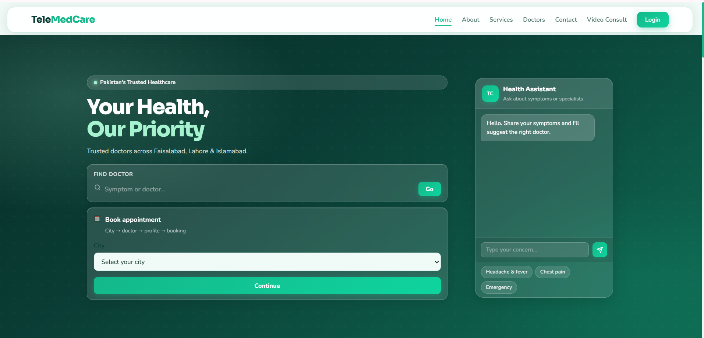
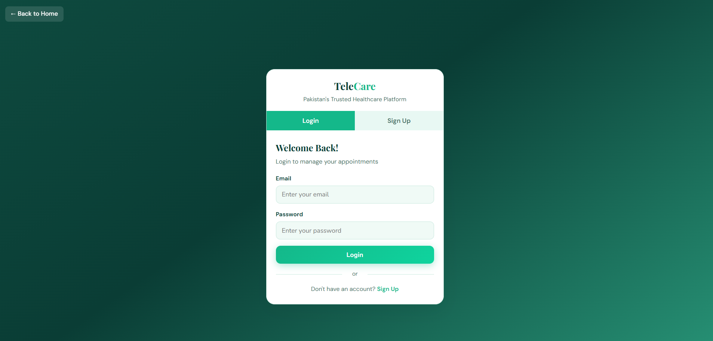
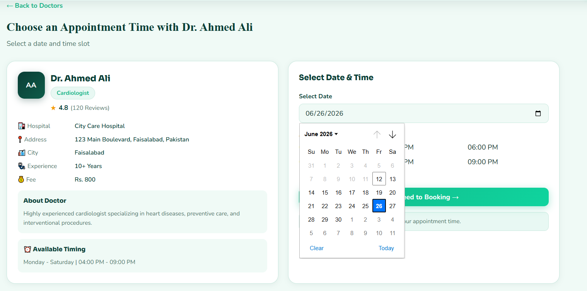

# 🏥 TeleMedCare

An AI-Powered Healthcare Management System developed as my Final Year Project using HTML, CSS, PHP, Python, MySQL, and XAMPP.

---

## 📌 Project Overview

TeleMedCare is a web-based healthcare platform designed to simplify communication between patients and doctors. The system allows users to book appointments, consult doctors through video sessions, and receive instant health guidance from an AI-powered chatbot. The project aims to improve healthcare accessibility by combining modern web technologies with artificial intelligence.

---

## ✨ Features

- 🔐 User Authentication (Login & Signup)
- 👨‍⚕️ Doctor Management
- 📅 Online Appointment Booking
- 🎥 Video Consultation
- 🤖 AI Healthcare Chatbot
- 💬 Basic Medical Guidance
- 🗄️ MySQL Database Integration
- 📱 Responsive User Interface

---

## 🛠️ Tech Stack

| Technology | Used |
|------------|------|
| HTML5 | ✅ |
| CSS3 | ✅ |
| PHP | ✅ |
| Python | ✅ |
| MySQL | ✅ |
| XAMPP | ✅ |

---

## 📂 Project Structure

```
TeleMedCare/
│
├── images/
├── auth.php
├── chatbot.php
├── chatbot.py
├── database.sql
├── index.html
├── login.html
├── style.css
├── video_consult.html
├── video_consult_backend.php
└── README.md
```

---

## ⚙️ Installation

1. Download or Clone this repository.

2. Copy the project folder into:

```
xampp/htdocs/
```

3. Start Apache and MySQL from XAMPP.

4. Import

```
database.sql
```

into phpMyAdmin.

5. Open your browser.

```
http://localhost/telecare
```

---

## 📸 Project Screenshots

### Home Page



### Login



### AI Chatbot


### Appointment Booking


### Doctor Dashboard



### Video Consultation


---

## 🚀 Future Improvements

- Online Payment Integration
- Email Notifications
- AI Symptom Prediction
- Electronic Medical Records
- Mobile Application

---

## 👩‍💻 Developer

**Hira Shahzadi**

Computer Science Graduate

GitHub:
https://github.com/webiconbyhira

---

⭐ If you like this project, don't forget to give it a Star.
